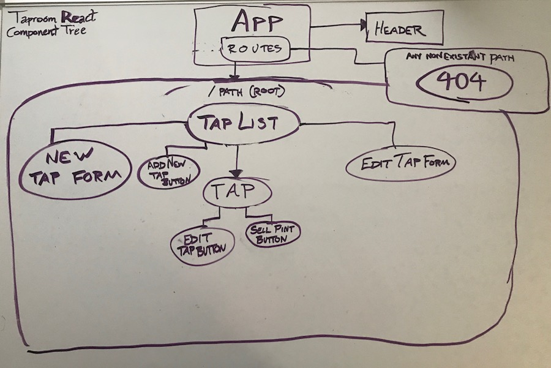

# React Taproom

#### A React application for tracking details about the kegs on tap at a taproom, February 9th, 2018

#### By **Luke Bertram**

## Description

This project uses React to build a component-based application for tracking details about the kegs on tap at a local taproom. Currently, this is just a static layout for the project. It will eventually allow for users to add, edit, and/or remove kegs.

**Angular vs React Process**

So far I've noticed 2 primary differences between building out this app in React and Angular:
1. **More Components** - Components in React seem to be far more granular in their purpose - so there are more of them. In my original Angular taproom app, the entire thing was housed inside a single component with a substantial view template. In the React version, that same template is broken into JSX and housed in many discrete components.

2. **Static First** - Following the process described in *[Thinking in React](https://reactjs.org/docs/thinking-in-react.html)*, the first step to building this application in React involves making a static layout with hard-coded data and no interactivity. Alternatively, when building the taproom in Angular, even the way elements were included in the view was dependent on data bindings. Functionality of UI elements was often added at the same time the element itself was added to the UI.

## Setup Instructions

Clone from [github](https://github.com/lukebertram/react-taproom) and run the following commands in the project's root directory:
```
$ npm install
$ npm start
```

Then, visit `localhost:8080` in your browser

### Component Tree


### Notes
**Unforeseen issue No. 1: Angular tap room would not run.**

My initial response to the prompt provided was to clone my Angular taproom project from github and take a look at it. After running `npm install`, I tried to run `ng serve` but the process stalled out when it could not find JQuery in the node_modules. I installed JQuery using `npm i jquery` and met with another error. The build process now could not find an installation of 'Tether' in the node_modules folder. I couldn't remember ever having to install tether for this project (or any angular project) in the past, but installing this project dependency seemed to be the last piece of the puzzle. Afterwards my Angular version of the taproom compiled and served properly.

**Unforeseen issue No. 2: Multiple routes required/not required**

In my original Angular taproom application everything lived on a single page with a single route. No routing was necessary for that project. If I were to merely copy that project, I wouldn't use a router in this React version either. However one of the project objectives listed in Epicenter reads as follows:

>Application successfully uses client-side routing via the React-Router library to create appearance of multiple pages.

I'm hoping that the presence of the Error404 component on any undefined routes will fulfill this objective to my instructor's satisfaction. If it doesn't, I may have to deviate from the original Angular app's structure by breaking the New Tap Form component out into its own route.

**Unforeseen issue No. 3: Hiding/showing new keg and edit keg forms**

Without access to the ngIf statements of Angular and knowing only static React thus far, I have no idea how to hide and show the form for adding a new keg or the form for editing an already existing keg. I have placed the edit and new keg forms inside the taplist, similar to where they were placed in the Angular version of the application, and I'm assuming that there will be a way to dynamically hide and show these elements once I begin introducing state into the application.

## Requirements From Angular Taproom Project

- [ ] As a patron, I want to see a list/menu of all available kegs. For each keg, I need to see its name, brand, price and alcoholContent (or perhaps something like flavor for a kombucha store).

- [ ] As an employee, I want to fill out a form when I tap a new keg to add it to the list. (Don't worry about authenticating employee user accounts yet.)

- [ ] As an employee, I want the option to edit a keg's properties after entering them just in case I make a mistake.

- [ ] As a patron and/or employee, I want to see how many pints are left in a keg. (Hint: A full keg has roughly 124 pints).

- [ ] As an employee, I want to be able to click a button next to a keg whenever I sell a pint of it. This should decrease the number of pints left by 1.

- [ ] As an employee, I want to be able to see kegs with less than 10 pints left so I can be ready to change them.

- [ ] As a patron, I want to have kegs prices to be color-coded for easy readability. Perhaps based on their price (greater or less than $5 per pint, perhaps) or the particular style of beer or kombucha.

- [ ] As a patron, I want to use the alcohol content property to display stronger beers differently than weaker beers.
